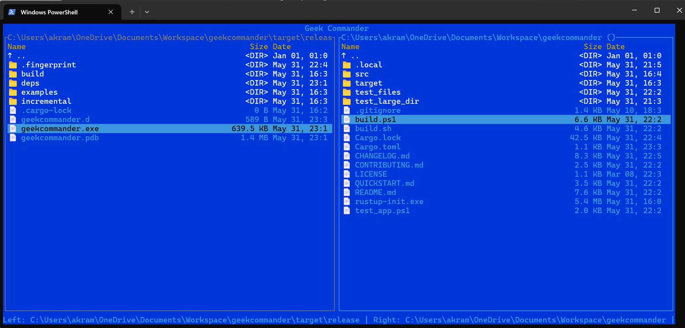

# Geek Commander

A modern, cross-platform, dual-pane file manager inspired by Norton Commander, built with Rust, tui-rs, and crossterm.



## Overview

Geek Commander brings the classic Norton Commander experience to modern terminals, providing:

- **Dual-pane interface** with independent navigation
- **Keyboard-driven controls** (F1-F10 function keys, arrows, Tab)
- **File operations**: copy, move, delete, rename, create directory
- **Archive support**: browse and extract ZIP, TAR, TGZ files
- **Cross-platform**: Works on Windows, Linux, and macOS
- **Configurable**: Customizable keybindings and colors
- **Fast and lightweight**: Built with Rust for performance and safety

## Installation

### Prerequisites

You'll need Rust installed on your system. If you don't have Rust installed:

#### Windows:
1. Download and run [rustup-init.exe](https://win.rustup.rs/)
2. Follow the installer prompts (use default options)
3. Restart your terminal/PowerShell

#### Linux/macOS:
```bash
curl --proto '=https' --tlsv1.2 -sSf https://sh.rustup.rs | sh
source ~/.cargo/env
```

### Building from Source

1. Clone or download this repository
2. Open a terminal in the project directory
3. Build the project:

```bash
# For development (with debug info)
cargo build

# For release (optimized)
cargo build --release
```

4. Run the application:

```bash
# Development build
cargo run

# Or run the release binary directly
./target/release/geekcommander        # Linux/macOS
.\target\release\geekcommander.exe    # Windows
```

### Installation Options

#### Option 1: Install with Cargo
```bash
cargo install --path .
```

#### Option 2: Copy Binary
After building, copy the binary to a directory in your PATH:

**Linux/macOS:**
```bash
sudo cp target/release/geekcommander /usr/local/bin/
```

**Windows:**
```powershell
Copy-Item target\release\geekcommander.exe C:\Windows\System32\
```

## Usage

### Quick Start

1. Launch the application:
   ```bash
   geekcommander
   ```

2. Navigate using:
   - **↑/↓**: Move cursor up/down
   - **Tab**: Switch between left and right panes
   - **Enter**: Enter directory or view file
   - **Backspace**: Go to parent directory

3. Use function keys for file operations:
   - **F1**: Help
   - **F5**: Copy
   - **F6**: Move/Rename
   - **F7**: Create directory
   - **F8**: Delete
   - **F10**: Quit

### Key Bindings

| Key | Action |
|-----|--------|
| **F1** | Show help screen |
| **F3** | View file |
| **F4** | Edit file |
| **F5** | Copy selected files |
| **F6** | Move/rename files |
| **F7** | Create new directory |
| **F8** | Delete selected files |
| **F10** | Quit application |
| **Tab** | Switch active pane |
| **↑/↓** | Move cursor |
| **Enter** | Enter directory/open file |
| **Backspace** | Go to parent directory |
| **Insert** | Select/unselect file |
| **Ctrl+A** | Select all files |

### Command Line Options

```
geekcommander [OPTIONS]

Options:
    --config <FILE>     Use custom config file
    --left <PATH>       Set left pane start directory
    --right <PATH>      Set right pane start directory
    --no-color          Force monochrome mode
    -h, --help          Show help information
    -V, --version       Show version information
```

## Configuration

Geek Commander creates a configuration file at:
- **Linux/macOS**: `~/.geekcommanderrc`
- **Windows**: `%USERPROFILE%\.geekcommanderrc`

### Sample Configuration

```ini
[Keybindings]
Help=F1
Copy=F5
Move=Shift+F5
Delete=F8
Rename=F6
NewDir=F7
Quit=F10
View=F3
Edit=F4
Select=Insert
SelectAll=Ctrl+A
Wildcard=*
Reload=Ctrl+R

[Colors]
ActivePaneBorder=cyan
InactivePaneBorder=white
SelectedItem=yellow
StatusBar=white
DirectoryFg=blue
FileFg=white

[Panels]
Left=~
Right=~

[Logging]
Level=INFO
File=~/.geekcommander.log

[General]
ShowHidden=false
FollowSymlinks=true
```

### Customization

- **Keybindings**: Modify the `[Keybindings]` section to change key mappings
- **Colors**: Available colors: black, red, green, yellow, blue, magenta, cyan, white
- **Start Paths**: Set default directories for left and right panes
- **Hidden Files**: Toggle visibility of hidden files (files starting with `.`)

## Features

### Dual-Pane File Management
- Independent navigation in left and right panes
- Visual indication of active pane
- Path display in pane headers
- File size and type indicators

### File Operations
- **Copy (F5)**: Copy files between panes with progress indication
- **Move (F6)**: Move files or rename single files
- **Delete (F8)**: Delete files and directories with confirmation
- **Create Directory (F7)**: Create new directories
- **File Selection**: Multi-select with Insert key

### Archive Support
- **Browse Archives**: Navigate inside ZIP, TAR, and TGZ files
- **Extract Files**: Extract archive contents to filesystem
- **Create Archives**: Add files to ZIP archives

### Cross-Platform Features
- **Windows**: Native Windows Terminal and PowerShell support
- **Linux**: Works with all major terminal emulators
- **macOS**: Full Terminal.app and iTerm2 compatibility

## Development

### Project Structure

```
src/
├── main.rs          # Application entry point
├── config.rs        # Configuration handling
├── core.rs          # File operations and pane management
├── ui.rs            # Terminal UI with tui-rs
├── archive.rs       # Archive file support
├── platform.rs      # Cross-platform utilities
└── error.rs         # Error types and handling
```

### Building for Different Targets

```bash
# Windows (from Linux/macOS)
cargo build --target x86_64-pc-windows-gnu

# Linux (static binary)
cargo build --target x86_64-unknown-linux-musl

# macOS
cargo build --target x86_64-apple-darwin
```

### Running Tests

```bash
# Run unit tests
cargo test

# Run with output
cargo test -- --nocapture

# Run specific test
cargo test test_name
```

## Contributing

1. Fork the repository
2. Create a feature branch (`git checkout -b feature/amazing-feature`)
3. Commit your changes (`git commit -m 'Add amazing feature'`)
4. Push to the branch (`git push origin feature/amazing-feature`)
5. Open a Pull Request

### Code Style

- Use `cargo fmt` to format code
- Use `cargo clippy` to check for common issues
- Follow Rust naming conventions
- Add tests for new functionality

## License

This project is licensed under the MIT License - see the [LICENSE](LICENSE) file for details.

## Acknowledgments

- Inspired by the original Norton Commander
- Built with [tui-rs](https://github.com/fdehau/tui-rs) and [crossterm](https://github.com/crossterm-rs/crossterm)
- Thanks to the Rust community for excellent libraries and tools

## Troubleshooting

### Common Issues

**Terminal Size Too Small:**
```
Error: Terminal too small. Minimum size: 80x24
```
Solution: Resize your terminal window or use `--no-color` flag.

**Permission Denied:**
```
Error: Permission denied accessing directory
```
Solution: Check file permissions or run with appropriate privileges.

**Config File Errors:**
```
Warning: Invalid keybinding 'F99' - using default
```
Solution: Check your `~/.geekcommanderrc` file for invalid entries.

### Logging

Debug information is logged to:
- **Linux/macOS**: `~/.geekcommander.log`
- **Windows**: `%USERPROFILE%\.geekcommander.log`

Set log level in config file:
```ini
[Logging]
Level=DEBUG  # Options: ERROR, WARN, INFO, DEBUG, TRACE
```

---

For more information, visit the [project repository](https://github.com/akram0zaki/geekcommander) or open an issue. 